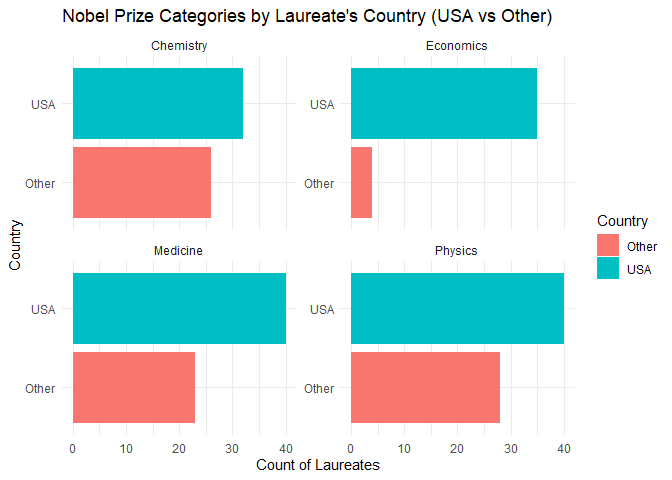
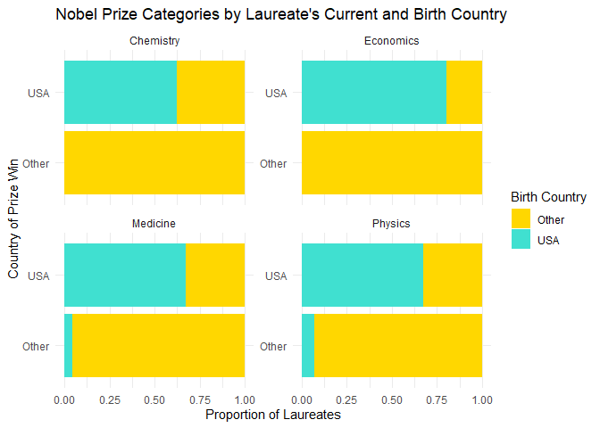

Lab 03 - Nobel laureates
================
Jamieson Nathan
5/2/2025

### Load packages and data

``` r
library(tidyverse) 
```

``` r
nobel <- read_csv("data/nobel.csv")
```

## Exercises

### Exercise 1

``` r
dim(nobel)  # The first element is the number of rows and the second is the number of columns
```

    ## [1] 935  26

``` r
head(nobel) # descriptions of rows
```

    ## # A tibble: 6 × 26
    ##      id firstname    surname  year category affiliation city  country born_date 
    ##   <dbl> <chr>        <chr>   <dbl> <chr>    <chr>       <chr> <chr>   <date>    
    ## 1     1 Wilhelm Con… Röntgen  1901 Physics  Munich Uni… Muni… Germany 1845-03-27
    ## 2     2 Hendrik A.   Lorentz  1902 Physics  Leiden Uni… Leid… Nether… 1853-07-18
    ## 3     3 Pieter       Zeeman   1902 Physics  Amsterdam … Amst… Nether… 1865-05-25
    ## 4     4 Henri        Becque…  1903 Physics  École Poly… Paris France  1852-12-15
    ## 5     5 Pierre       Curie    1903 Physics  École muni… Paris France  1859-05-15
    ## 6     6 Marie        Curie    1903 Physics  <NA>        <NA>  <NA>    1867-11-07
    ## # ℹ 17 more variables: died_date <date>, gender <chr>, born_city <chr>,
    ## #   born_country <chr>, born_country_code <chr>, died_city <chr>,
    ## #   died_country <chr>, died_country_code <chr>, overall_motivation <chr>,
    ## #   share <dbl>, motivation <chr>, born_country_original <chr>,
    ## #   born_city_original <chr>, died_country_original <chr>,
    ## #   died_city_original <chr>, city_original <chr>, country_original <chr>

There appear to be 935 rows and 26 columns. As we can see in the above
tibble, the rows refer to each individual Nobel laureate, and the
columns give specific information like their name, year they won, what
category it was, etc.

### Exercise 2

``` r
library(dplyr)

nobel_living <- nobel %>%
  filter(is.na(died_date), !is.na(country), gender != "org")

nrow(nobel_living)
```

    ## [1] 228

Confirmed that after filtering for currently living, country-available,
and individual (not organisation) lareates, there are 228 remaining
entries.

### Exercise 3

``` r
nobel_living <- nobel_living %>%
  mutate(
    country_us = if_else(country == "USA", "USA", "Other")
  )

nobel_living_science <- nobel_living %>%
  filter(category %in% c("Physics", "Medicine", "Chemistry", "Economics"))

library(ggplot2)

ggplot(nobel_living_science, aes(x = country_us, fill = country_us)) +
  geom_bar() +
  facet_wrap(~ category, scales = "free_y") +
  coord_flip() +
  labs(title = "Nobel Prize Categories by Laureate's Country (USA vs Other)",
       x = "Country",
       y = "Count of Laureates",
       fill = "Country") +
  theme_minimal()
```

<!-- -->

It appears that the buzzfeed article, remarkably, was accurate and that
most Nobel Prize Laureates were in fact US-based when they won.

### Exercise 4

``` r
nobel_living <- nobel_living %>%
  mutate(born_country_us = if_else(born_country == "USA", "USA", "Other"))

nobel_living_science <- nobel_living %>%
  filter(category %in% c("Physics", "Medicine", "Chemistry", "Economics")) %>%
  mutate(born_country_us = if_else(born_country == "USA", "USA", "Other"))

nobel_living %>% 
  summarise(Count_US_Born = sum(born_country_us == "USA"))
```

    ## # A tibble: 1 × 1
    ##   Count_US_Born
    ##           <int>
    ## 1           105

By creating and summarizing this new variable, we find that 105 of the
USA winners were born in the USA.

### Exercise 5

``` r
ggplot(nobel_living_science, aes(x = country_us, fill = born_country_us)) +
  geom_bar(position = "fill") +
  facet_wrap(~ category, scales = "free_y") +
  coord_flip() +
  scale_fill_manual(values = c("USA" = "turquoise", "Other" = "gold")) +
  labs(title = "Nobel Prize Categories by Laureate's Current and Birth Country",
       x = "Country of Prize Win",
       y = "Proportion of Laureates",
       fill = "Birth Country") +
  theme_minimal()
```

<!-- --> Based on the new
data visual, it appears that it is accurate to say that some (perhaps
not ‘many’) of the US-Based winners were immigrants or born elsewhere.

### Exercise 6

``` r
us_winners_foreign_born <- nobel_living %>%
  filter(country_us == "USA" & born_country_us == "Other") %>%
  count(born_country) %>%
  arrange(desc(n))

print(us_winners_foreign_born)
```

    ## # A tibble: 21 × 2
    ##    born_country       n
    ##    <chr>          <int>
    ##  1 Germany            7
    ##  2 United Kingdom     7
    ##  3 China              5
    ##  4 Canada             4
    ##  5 Japan              3
    ##  6 Australia          2
    ##  7 Israel             2
    ##  8 Norway             2
    ##  9 Austria            1
    ## 10 Finland            1
    ## # ℹ 11 more rows

The most common appear to be the UK and Germany.

In general, I actually struggle to see the why they use this data to
support anti-immigration sentiment, as this pretty categorically shows
that US-Immigrant laureates are from other Developed nations, where the
petition and executive order this article is drumming support against is
targeted at developing, Muslim nations. Nonetheless, an interesting
exercise!
